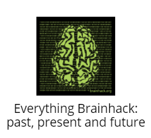

# translate-bh-glossary

<h3 align="center">Make Brainhack Accessible WorldWide: Translation of Brainhack Glossary into Different Languages<h3>

<!-- PROJECT IMAGE -->

  

  Registered Brainhack Global 2022 Event: Brainhack Geneva
     
     
  Project Instigator: Abigail Licata (@licataae)
     
     
  Project collaborators:
  

<!-- ABOUT THE PROJECT -->
## About The Project

The project aims to bring together Brainhack and Open Science terms together into one, unified glossary to help newcomers quickly integrate into the community. In this project, we would like to take the glossary a step further by translating it into as many different languages as possible. This helps to remove language barriers and create an inclusive resource for all members.

In the project, you can either open a new issue and translate the glossary into a new language or you can work on an existing translation if not yet completed. The general flow of the project is as follows:

- [ ] Read and understood the project description and workflow for the translation work
- [ ] Complete the translation
- [ ] Proofread the translation
- [ ] Request a review of the translated glossary from **two native speakers**
- [ ] Incorporate the comments and edits from two native speakers into the translated glossary
- [ ] Merge the completed, proofread and reviewed translated glossary to the [main branch](https://github.com/brainhackorg/brainhack_jupyter_book) via [pull request (PR)](https://www.atlassian.com/git/tutorials/making-a-pull-request)

**Data to use:**
The [glossary](http://brainhack.org/brainhack_jupyter_book/glossary_en.html#) itself and references listed at the bottom of the glossary and any other community developed open science glossaries to match the references.

**Link to project repository & resources:**
* [Brainhack Jupyter Book](http://brainhack.org/brainhack_jupyter_book/)
* [Main Repository](https://github.com/brainhackorg/brainhack_jupyter_book)
* [Translation Issues](https://github.com/brainhackorg/brainhack_jupyter_book/issues?q=is%3Aopen+is%3Aissue+milestone%3ATranslations)
* [Brainhack Contributing Guidelines](https://github.com/licataae/brainhack_jupyter_book/blob/main/CONTRIBUTING.md)

**Goals for Brainhack Global 2022:**
Make the glossary complete with all necessary terms to serve the best of the community and translate it into different languages to make it more accessible to the global community.

**Good first issues:**

 * Complete the glossary by defining missing terms
 * Translate the glossary into different languages
 * Merge the complete, translated versions to the Jupyter Book by creating a Pull Request

**Skills:**
* Native or advanced proficiency in the language being translated
* Basic knowledge in using Git/Github (opening an issue, modifying an existing issue, submitting a pull request (PR)

**Tools/Software/Methods to Use:**
* Github repository
* Google docs

**Communication channels:**
* [Mattermost Brainhack Channel](https://mattermost.brainhack.org/brainhack/channels/brainhack_paper_jupyterbook)

## Project labels

**Type of project:**
#data_management, #documentation

**Project development status:**
#0_concept_no_content, #1_basic structure

**Tools skill level required to enter the project (more than one possible):**
#familiar, #no_skills_required

**Programming language used in the project:**
#documentation

**Git skills reuired to enter the project (more than one possible):**
#0_no_git_skills, #1_commit_push, #2_branches_PRs, #3_continuous_integration

## Project Submission

**Submission checklist**

Once you have either opened a new issue/translation or started working on an existing one, please link the google document of the translated glossary in the issue (please use the central [Google Drive](https://link-url-here.org) for translations, existing translations are here as well)

In the issue, please make sure to check off these steps (you can copy it into the issue and check the boxes as you go) & include the names or profiles of any other collaborators:

**Collaborators**
- [ ] I read and understood the project description.
- [ ] I read and understood the workflow for the translation work.
- [ ] Translation has been completed
- [ ] Translated has been proofread
- [ ] Reviews from **two native speakers** have been requested (link reviewer names/profiles)
- [ ] Reviews from two native speakers have been incorporated into the translated glossary
- [ ] Completed, proofread and reviewed translated glossary has been merged to the main branch via PR
  
